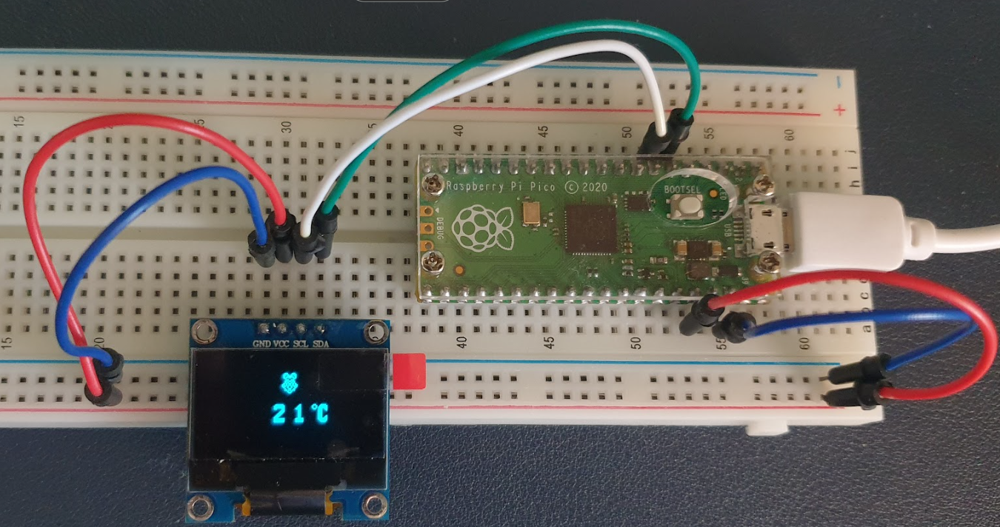
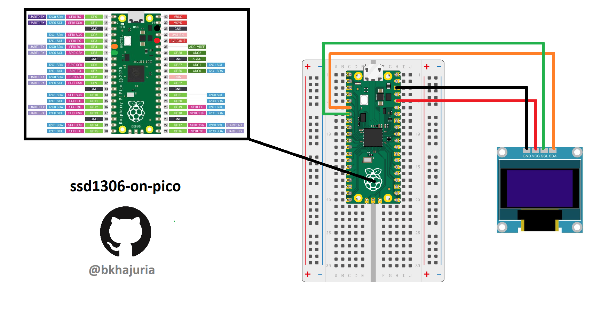

# **ssd1306-on-pico**
A small extensible rendering library for [**SSD1306 OLED display**](https://www.adafruit.com/product/326) on [**Raspberry Pi Pico**](https://www.raspberrypi.com/products/raspberry-pi-pico/).

This is ported from [**ssd1306-on-linux**](https://github.com/bkhajuria/ssd1306-on-linux) repository and tested on Raspberry Pi Pico.

**What's included:**
1. A simple rendering library to render digits and symbols on SSD1306. [[digitRenderer](https://github.com/bkhajuria/ssd1306-on-pico/tree/main/digitRenderer)]
2. A Pico I2C *wrapper* to communicate with SSD1306. [[i2cSend](https://github.com/bkhajuria/ssd1306-on-pico/tree/main/i2cSend)]
3. A utility to create new symbols to display on SSD1306. [[mapGenerator](https://github.com/bkhajuria/ssd1306-on-pico/tree/main/mapGenerator)]
4. A program to display the value of Pico's onboard temperature sensor on SSD1306. [[main.c](https://github.com/bkhajuria/ssd1306-on-pico/tree/main/main.c)]

## Wiring (for Raspberry Pi Pico)

## Build and Run the program
The main program [main.c]() uses the [digitRenderer]() library to render digits/symbols on SSD1306 and the [i2cSend]() wrapper to send commands and data to SSD1306. The main loop reads the value of the onboard temperature sensor and displays it to the SSD1306 display.

Steps to build and run the program:
- [Setup the Pico SDK](https://datasheets.raspberrypi.com/pico/getting-started-with-pico.pdf) on your system if not already done.
- Create a new directory in the same directory as `pico-sdk`. Let's name it `pico-projects`.
- Clone this repository to `pico-projects` directory using `git clone https://github.com/bkhajuria/ssd1306-on-pico.git`.
- Switch to the directory `ssd1306-on-pico`.
- Create a new directory named `build` and switch to it `mkdir build && cd build`.
- Run `cmake ..`. Build configuration will be done and build files will be written.
- Run `make`. Upon succesful build, target files `ssd1306pico.elf`, `ssd1306pico.uf2` will be generated.

    TIP: To speed up the build process, use `make -j4` or `make -j6` depending upon the number of cores available on the system.
- Now flash the Pico by connecting it as a USB mass storage device. To do this, press and hold the *BOOTSEL* button on Pico, connect it to the system via USB and then release the button. (Checkout the [guide](https://datasheets.raspberrypi.com/pico/getting-started-with-pico.pdf)).
- Once connected, drag and drop the `ssd1306pico.uf2` file to the mass storage device. It will get ejected automatically and the program will start running on Pico.

## Adding new Symbols/Characters
New symbols can be created using the [mapGenerator](https://github.com/bkhajuria/ssd1306-on-pico/tree/main/mapGenerator) utility.

Below illustration adds and displays the *Raspberry Pi logo*:
- In [mapGen.c](https://github.com/bkhajuria/ssd1306-on-pico/tree/main/mapGenerator/mapGen.c), Add a new 16*16 matrix to the the `symbolMap` array that represents Raspberry Pi logo.
- Increase the value of `NUM_SYMBOLS` macro by 1 (since we added one symbol).
- Build by running `make` in the *mapGenerator* directory.
- Run the generated executable as `./mapGen`.
- It will print the bitmaps for all the digits and symbols.
- Copy the 32-byte bitmap generated for the new symbol.
- Add the bitmap to the `symbolMap` array in [digitRenderer.c](https://github.com/bkhajuria/ssd1306-on-pico/tree/main/digitRenderer/digitRenderer.c). Increase the value of `NUM_SYMBOLS` macro by 1.
- Add enumeration for the new symbol in [digitRenderer.h](https://github.com/bkhajuria/ssd1306-on-pico/tree/main/digitRenderer/digitRenderer.h). 
- To test rendering the new symbol use the `renderSymbol` function.

## Resources
- [SSD1306 Datasheet](https://cdn-shop.adafruit.com/datasheets/SSD1306.pdf)
- [RP2040 Datasheet](https://datasheets.raspberrypi.com/rp2040/rp2040-datasheet.pdf)
- [Getting Started with Pico](https://datasheets.raspberrypi.com/pico/getting-started-with-pico.pdf)

